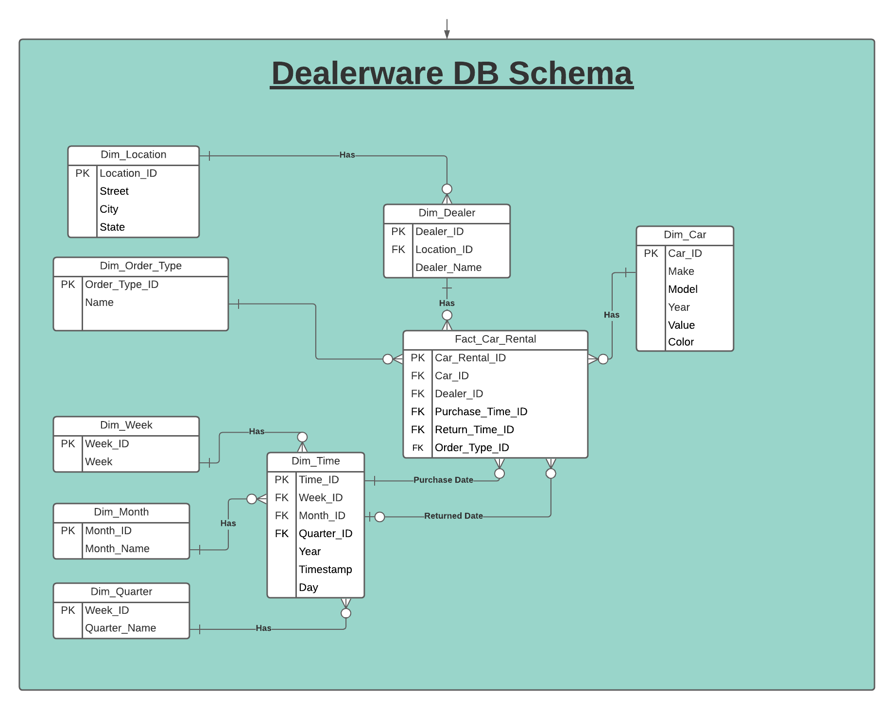
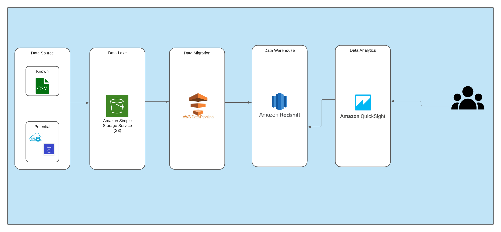

# Building a data pipeline for car information

## Database Design

I have proceeded to create a simplistic database design following the snowflake schema methodology. In doing so we can utilize less disk space as a result of data normalization and therefore minimal data redundancy. This will help provide protection from data integrity issues. Maintenance is simple due to a smaller risk of data integrity violations and low level of data redundancy.

## Workflow

This workflow diagram details a potential solution that will allow us to convert raw csv files into S3 buckets and then into a datawarehouse where our snowflake database design will reside. This will then allow us to set up AWS QuickSight to enable analysts access to quick insights.

## Software

I have opted to use an entire AWS ecosystem to setup my proposed data pipeline. While this is definitely not required, I wanted to take a simple approach that will acheive my desired outcome with the knowledge I was presented with. A deeper investigation into all the specific business needs and use cases would need to be analyzed to ensure that the proper technologies are being used to support the business functions.

### Tech Stack Required

#### AWS Services

###### -Amazon S3

Amazon S3 is being used to store all of our csv files prior to converting them into our data warehouse. S3 will allow us to store all of our objects into buckets. S3 supports the transfer of data on SSL and also enables automatic encryption of data upon the completion of uploading. Importantly, it allows us to configure policies which will manage permissions grant to an object. We can control the access to valuable information by utilising AWS Identity.

We can pair S3 with AWS Event Notifications to notify us when any changes or events take place. This allows us to monitor and control our data closely.

###### -Amazon Data Pipeline

Amazon Data Pipeline is being used as our ETL process to convert our csv files into Redshift table entries. AWS Data Pipeline is made on a distributed, extremely accessible infrastructure designed for fault tolerant execution of our activities. If failures occur, Amazon data Pipeline will automatically retry the activity. If the failure persists, AWS Data Pipeline sends us a failure notifications via Amazon Simple Notification Service. AWS Data Pipeline makes it equally simple to dispatch work to at least one machine or several, in serial or parallel.

We'll use Data Pipeline to move over only the information required for analysis. By not exporting all data we can cut down on resources and expenses.

###### -Amazon Redshift

Amazon Redshift will allow us to query large amounts of data separate from our application database, so if we ever need to connect a database to Redshift we can. Instead of running taxing queries against your application database (or your read replica), we can run fast queries by setting up a dedicated BI database for running such queries. We can also connect to it via Postgres clients and easily run Postgres SQL queries (even through Python).

We are going to be setting up staging tables to perform our transformations, validations, and data cleansing. This will ensure that our source data stays untouched and that we are able to modify the data as needed prior to uploading into final database.

###### -Amazon QuickSight

QuickSight is a scalable, serverless, machine learning-powered business intelligence tool designed with the cloud in mind. QuickSight lets us easily create and publish interactive dashboards that include ML-powered insights. QuickSight dashboards can be accessed from any device, and seamlessly embedded into your applications, portals, and websites.

###### -Simple Notification Services & Event Notifications

We're utilizing AWS Simple Notification Services & Event Notifications to monitor the above processes and ensure tasks are properly getting executed.

#### Programming Language

###### -Python3

We are opting to use Python3 with a combination of boto3 AWS SDK and other packages to interact and modify our data pipeline. This will allow us to customize any of the processes in our pipeline and fully automate any of our tasks.

## Initial Load

During the initial load, we'll need to make sure that we initialize all of our resources. This includes our S3 bucket, AWS Data Pipeline, AWS Redshift. Once these services are up and running we'll need to make sure that we set up our Redshift DB to reflect our proposed Entity Relationship Diagram. 

## Data Cleansing

We are going to be setting up staging tables to perform our transformations, validations, and data cleansing. This will ensure that our source data stays untouched and that we are able to modify the data as needed prior to uploading into final database.

## Security Protocols

Because AWS provides end-to-end encryption in AWS S3 and Redshift we can be sure that our data is protected against threats. We also need to make sure to utilize AWS Identity and Access Management (IAM) to make sure that our data pipeline and users are only allowed access that they need to have to carry out their business funtions. 

Examples:
  
  1. Making sure that when we're allowing the data pipeline to read information from S3 we aren't allowing for it to have any write access. This ensures that our raw data remains intact and that we can keep our data integrity at the base level.

  2. We also need to limit which users can have write access to both S3 and Redshift(if any). For instance, most of our analysts utilizing QuickSearch probably won't also need to be adding any data to our pipeline.

## Modeling

By using Redshift we can take advantage of Redshift ML which is a new capability for Amazon Redshift that make it easy for data analysts and database developers to create, train, and deploy Amazon SageMaker models using SQL. With Amazon Redshift ML, analysts can use SQL statements to create and train SageMaker models on our data in Amazon Redshift and then use those models for predictions such as which cars are more likely to be purchased/rented at specific dealers. We can use this data to accurately identify where best to deploy specific models of cars based on a wide variety of features.

## Scalability

We can easily scale up and down each of the mentioned services as desired as AWS gives us complete control and flexibility with each of these services by paying for what we need and not what we don't.

## Analytics

AWS QuickSight pairs well with Redshift and will easily allow our users/analysts to quickly and efficiently retrieve and analyze data from our data warehouse. We have also optimized our database to allow for quick and efficient queries to be run that can get to the desired granularity that analysts need to see.

## Notifications and Monitoring

We're utilizing AWS Simple Notification Services & Event Notifications to monitor the above processes and ensure tasks are properly getting executed.

